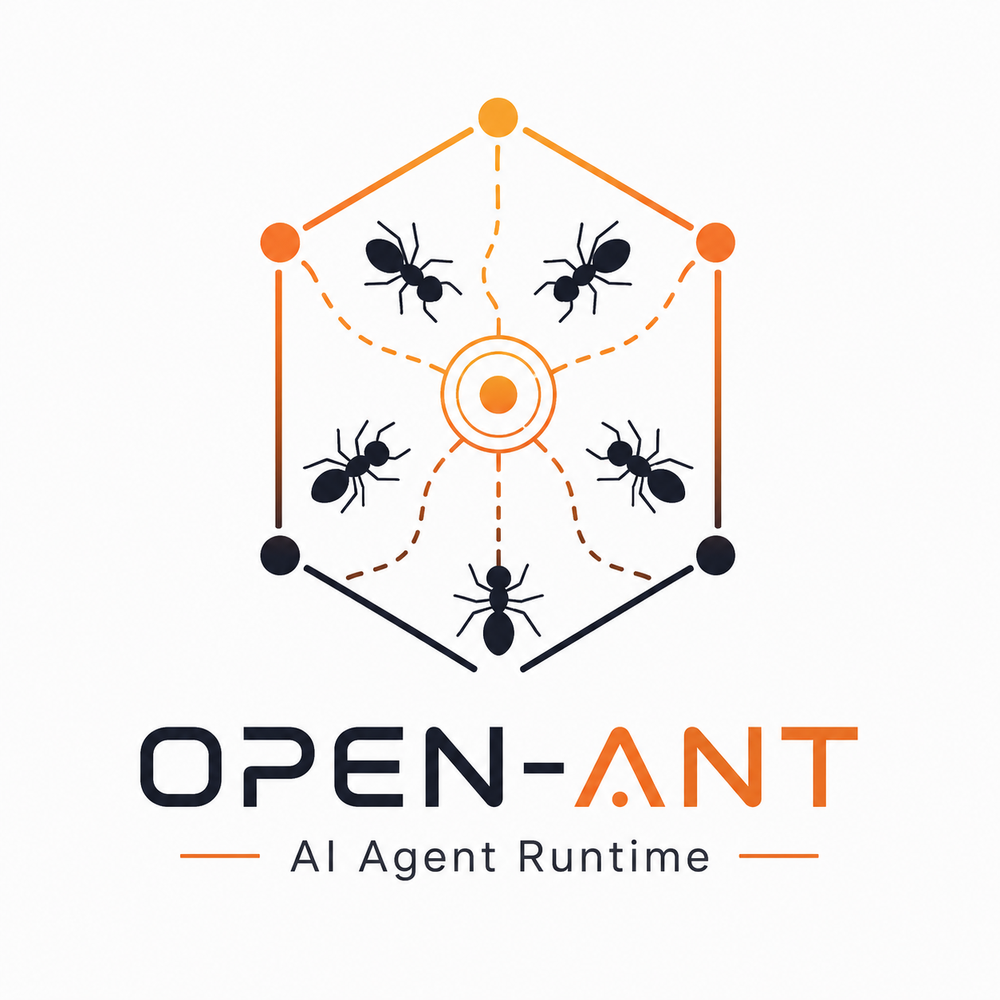
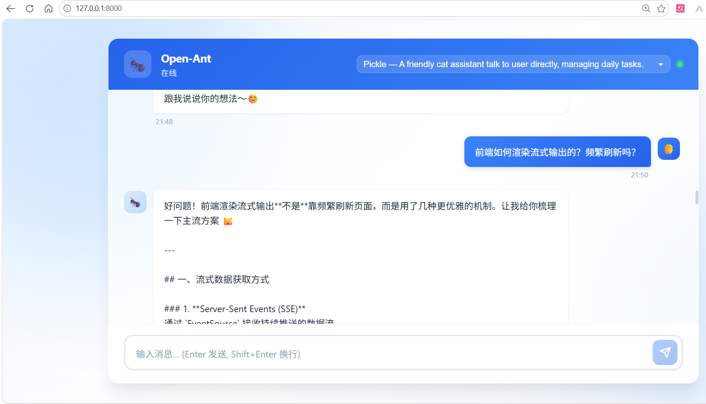

<div align="center">

# 🐜 Open-Ant

### Production-ready AI Agent Runtime

**Event-driven · Multi-Agent · Tool Calling · AI Microservice**

---

*"A single ant is simple. A colony is intelligent."*

</div>

---


> 📖 此仓库是 [build-your-own-openclaw](https://github.com/czl9707/build-your-own-openclaw) 的后续实现，我们计划加入 RAG、MCP、Java 生态通信等新功能。
> 在阅读本仓库之前，您应当具有 LangChain 和 LangGraph 等 Agent 相关知识，或者跟随 build-your-own-openclaw 学习了如何开发 Agent 运行时框架。

## 🐜 Why Open-Ant?

现实中的蚂蚁个体能力有限，但依靠**信息素（Pheromone）**、**分工协作**和**持续通信**，整个蚁群能够完成远超单个个体能力的复杂任务。

Open-Ant 借鉴了这一思想：

| 🐜 蚁群 | 🤖 Open-Ant |
|---------|------------|
| Ant | Agent |
| Pheromone | EventBus |
| Colony | Multi-Agent Runtime |
| Division of Labor | Tool Calling |
| Nest | Runtime |
| Memory | Long-term Memory |
| Cooperation | Agent-to-Agent Delegation |

在 Open-Ant 中：

- 🤖 每个 Agent 负责一个明确职责，而不是承担所有任务
- 📡 EventBus 像信息素一样传递事件，而不是模块直接调用
- 🔀 Routing Engine 决定事件应该交给哪一个 Agent
- 🛠 Tool Registry 不断扩展 Agent 的能力边界
- 🧠 Memory 保存长期知识，避免重复学习
- ⚡ Worker Runtime 负责整个蚁群持续运转

Open-Ant 希望构建的不是一个"万能 Agent"，而是一个能够持续协作、自我扩展的 **AI Colony Runtime**。

---

# 🏗 Architecture

```text
                            Browser / Mobile
                                   │
                           API Gateway
                                   │
                     Spring Boot Business Layer
                 (Auth · User · Order · Database)
                                   │
                      gRPC / Message Queue
                                   │
══════════════════════════════════════════════════════════════

                          🐜 Open-Ant Runtime

                     📡 EventBus (Pheromone)

                                   │

      ┌───────────────┬───────────────┬───────────────┐

      ▼               ▼               ▼

⚡ AgentWorker   ⚡ DeliveryWorker  ⚡ CronWorker

      │

      ▼

🤖 Agent Runtime

      │

 ┌──────────┬─────────────┬─────────────┬────────────┐

 ▼          ▼             ▼             ▼

🧠 Prompt   🛠 Tool      🔀 Routing   💬 Context

      │

      ▼

🧠 Memory

      │

      ▼

LiteLLM · Search · MCP · RAG
```

---

# ✨ Features

| | |
|------|------|
| 🤖 | Multi-Agent Collaboration |
| 📡 | Event-driven Runtime |
| ⚡ | asyncio Multi-Worker Runtime |
| 🔀 | Smart Routing Engine |
| 🛠 | Plugin-based Tool Registry |
| 🧠 | Prompt Builder |
| 🧠 | Context Guard |
| 🌐 | Multi-Channel Access (CLI / Telegram / Discord / WebSocket) |
| ⏰ | Cron Scheduler |
| ⚙ | Hot Reload Configuration |

---

# 🚀 Project Status

| Module | Status |
|---------|:------:|
| 📡 EventBus | ✅ |
| ⚡ Worker Runtime | ✅ |
| 🤖 Agent Runtime | ✅ |
| 🔀 Routing Engine | ✅ |
| 🛠 Tool Registry | ✅ |
| 🧠 Prompt Builder | ✅ |
| 🧠 Context Guard | ✅ |
| 🌐 Multi Channel | ✅ |
| ⚙ Config Hot Reload | ✅ |
| ⏰ Cron Scheduler | ✅ |
| 📖 Conversation History | ✅ |
| 🧠 RAG Memory | 🚧 |
| 🔌 MCP Protocol | 🚧 |
| ⚡ gRPC Service | 🚧 |
| 🟥 Redis Backend | 🚧 |
| 📊 OpenTelemetry | 🚧 |
| ☁ Distributed EventBus | 🚧 |

---

# 🧩 Core Components

## 📡 EventBus

> **The pheromone of the colony.**

整个 Runtime 的通信中枢。

负责：

- 📬 发布 / 订阅
- 🔄 Worker 解耦
- 💾 Pending Event 持久化
- ♻ 崩溃自动恢复
- ⚡ 异步事件流转

---

## 🤖 Agent Runtime

> **Every ant has only one responsibility.**

负责：

- Session 生命周期
- Tool Calling
- Prompt 调度
- Memory 管理
- Context 管理

支持多 Agent 协同。

---

## 🔀 Routing Engine

智能选择最适合处理当前任务的 Agent。

支持：

- 三层优先级
- 正则匹配
- Source Filter
- Runtime 动态绑定

---

## 🛠 Tool Registry

插件式工具体系。

动态注册：

- Skill
- Web Search
- Web Read
- SubAgent
- （未来）MCP Tool

---

## 🧠 Prompt Builder

五层 Prompt 组装：

```text
Identity
      ↓
Personality
      ↓
Bootstrap
      ↓
Runtime Context
      ↓
Channel Hint
```

模块化组合，而非硬编码 Prompt。

---

## 🧠 Context Guard

三级上下文保护：

```text
Truncate
      ↓
Token Estimate
      ↓
LLM Summary
```

保证长对话稳定运行。

---

## ⚙ Configuration Center

支持：

- Watchdog 热更新
- YAML 配置
- Pydantic 校验
- Runtime Reload

无需重启服务。

---

# 🛣 Roadmap

## 🧠 Phase 1 · RAG Memory

> Long-term Semantic Memory

```
Conversation
      │
      ▼
Memory Guard
      │
      ▼
Embedding
      │
      ▼
Vector Store
      │
      ▼
Similarity Search
      │
      ▼
Prompt Injection
```

**目标**

- ✅ 自动事实提取
- ✅ Embedding
- ✅ Vector Search
- ✅ Prompt Injection
- ✅ Long-term Memory

---

## 🔌 Phase 2 · MCP Native

支持：

- stdio
- SSE
- Dynamic Tool Discovery
- MCP Tool Adapter

---

## ⚡ Phase 3 · gRPC Microservice

Open-Ant 将作为独立 AI Runtime 部署。

```java
ChatResponse response = stub.chat(request);
```

业务系统无需关心 Agent 内部实现。

---

## 🟥 Phase 4 · Redis Infrastructure

统一迁移：

- Session
- History
- Event Store
- Cache

支持水平扩容。

---

## 📊 Phase 5 · Observability

支持：

- OpenTelemetry
- Metrics
- Trace
- Token Cost
- Structured Log

---

## ☁ Phase 6 · Distributed EventBus

将 EventBus 升级为：

- Redis Stream
- NATS

实现：

- 多实例
- Consumer Group
- Horizontal Scaling

---

## 🌌 Phase 7 · Workflow Runtime

支持 DAG Workflow：

```text
Planner

↓

Research Agent

↓

Coding Agent

↓

Review Agent

↓

Summarizer
```

---

# 📦 Tech Stack

| Layer | Technology |
|------|------|
| 🐍 Language | Python 3.12 |
| ⚡ Async Runtime | asyncio |
| 🤖 LLM | LiteLLM |
| 📡 Communication | Telegram / Discord / CLI / WebSocket |
| ⚙ Configuration | Pydantic · YAML · Watchdog |
| 🛠 Search | Tavily · Brave Search |
| 🌍 Web Reader | BeautifulSoup · LangChain |
| 🚧 RPC | gRPC |
| 🚧 Vector Store | ChromaDB |
| 🚧 Cache | Redis |
| 🚧 Telemetry | OpenTelemetry |

---

# 🎯 Design Philosophy

Open-Ant 遵循以下设计原则：

- 🐜 Small Agents, Powerful Colony
- 📡 Event-driven Everything
- 🛠 Plugin First
- 🔀 Routing over Hard Coding
- 🧠 Memory as Capability
- ⚡ Async by Default
- ☁ Cloud Native
- 🚀 Production Ready

---

<div align="center">

## 🐜 One Ant Is Small.

## 🐜 A Colony Can Change the World.

**Open-Ant is building an AI Colony Runtime.**

⭐ Star this project if you like it.

</div>